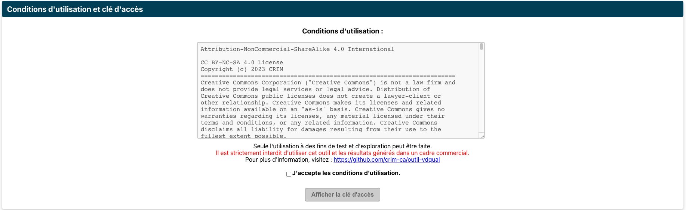
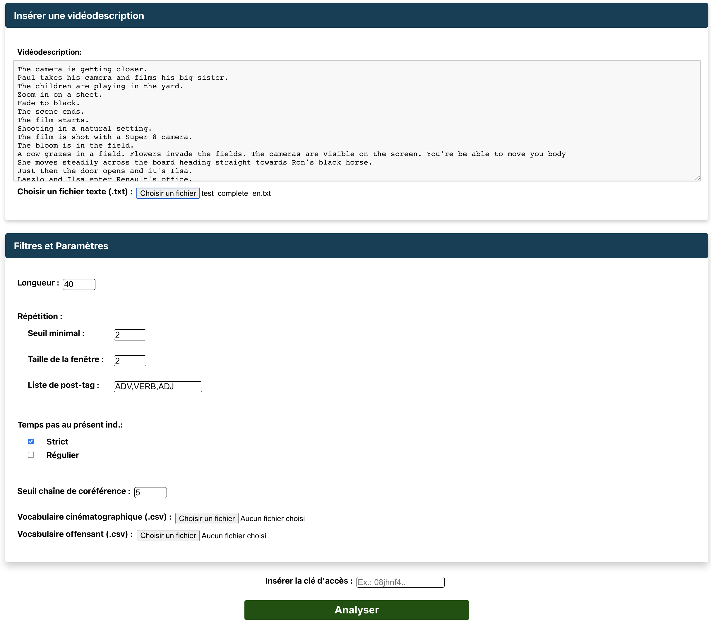
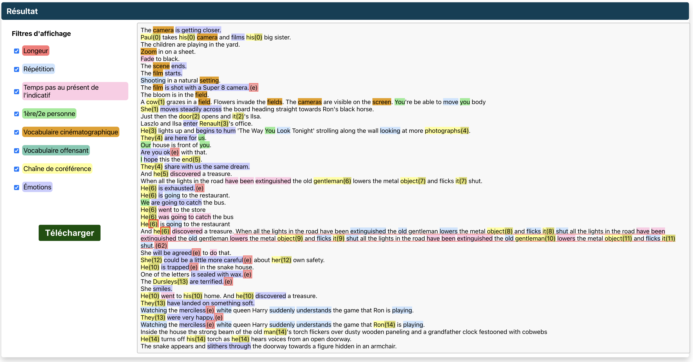

# VDQUAL-outil<!-- omit in toc -->

> This content is also available in English [here](./README_EN.md).

## Table des matières <!-- omit in toc -->
- [Licence](#licence)
- [Introduction](#introduction)
- [Détections](#détections)
- [VDQUAL-émotions](#vdqual-émotions)
- [Application et API en ligne au CRIM](#application-et-api-en-ligne-au-crim)
  - [Application web](#application-web)
    - [Conditions d'utilisation](#conditions-dutilisation)
    - [Insérer et analyser](#insérer-et-analyser)
    - [Résultat](#résultat)
  - [API](#api)
- [Installation, démarrage et utilisation locale avec un modèle personnalisé](#installation-démarrage-et-utilisation-locale-avec-un-modèle-personnalisé)
  - [Prérequis](#prérequis)
  - [Docker compose](#docker-compose)
  - [Makefile](#makefile)
- [Fonctionnement](#fonctionnement)
- [Contributeurs et remerciements](#contributeurs-et-remerciements)
- [Références](#références)
  - [Citation](#citation)

## Licence
[license-file]: ./LICENSE
Ce travail est sous [Licence MIT][license-file].<br>

Voir le fichier [LICENCE](LICENSE) pour plus de détails.

Veuillez voir également les requis de [Citation](#Citation).

<br><br>

## Introduction

**VDQUAL-outil : Outil de vérification de la qualité des vidéodescriptions en français et en anglais.**

L'outil est accessible en ligne à l'adresse suivante : https://vdqual.crim.ca .

Ce code a été utilisé dans le cadre d'un projet avec
le _Fonds pour l'accessibilité de la radiodiffusion_ ([FAR]((https://www.baf-far.ca/fr))).

Ce projet vise à développer un outil [VD-QUAL](https://vdqual.crim.ca/demo) de vérification de la qualité des
vidéodescriptions (VD)
de films et séries télévisées en anglais ou en français pour soutenir les intervenants impliqués dans
la production de VD et ainsi améliorer l’accessibilité des contenus radiodiffusés.

Nous prenons appui sur les guides de rédaction de VD qui soulignent la nécessité d’avoir des textes bien écrits pour
permettre aux personnes malvoyantes de jouir pleinement de leur expérience.
D’un point de vue textuel, les recommandations visent à assurer :

- Une bonne accessibilité du langage (au niveau lexical : registre de langue, polysémie à éviter,
  variété des verbes, etc.).
- La cohérence du texte (au niveau syntaxique : en évitant des confusions amenées par l’utilisation de coréférents,
  ou des temps de verbe inadéquats).
- L’absence d’interprétation du vidéodescripteur (au niveau sémantique : en évitant les marques de subjectivité et
  en ne décrivant que ce que l’on voit à l’écran).

L’outil que nous avons conçu vise donc à intégrer des règles de détection de certaines de ces recommandations.
Il s'agit d'un outil de recherche et d'exploration, offert à la communauté. Certaines détections sont exploratoires.

Nous avons implémenté 8 règles de détection en nous basant sur trois axes :

- **Texte clair et évident** :
    - **Détection des phrases trop longues** qui pourraient surcharger cognitivement l’auditeur.
    - **Détection des répétitions de lemmes** dans une fenêtre glissante qui peuvent rendre le texte rébarbatif.
    - **Détection des chaines de coréférence** trop longues qui peuvent rendre le texte confus. L'objectif est de
      garantir l’absence d'ambiguïté référentielle dans la vidéodescription analysée. En effet, tout au long de la
      vidéodescription d’une œuvre, l’auditeur doit savoir à qui on fait référence dans l'oeuvre visuelle. Lors de
      l’écriture d’une VD,
      le vidéodescripteur doit donc jongler entre des mentions explicites du nom du personnage ou d’un objet, mais il
      doit
      aussi garder une certaine fluidité pour ne pas alourdir le texte inutilement. On tolère donc de faire des reprises
      anaphoriques s'il n’y a pas d'ambiguïté sur le référent et si la mention du référent n’est pas trop éloignée.
      Cette détection est exploratoire et utilise [Coreferee](https://pypi.org/project/coreferee/), un outil de
      détection de coréférence.

- **Respect de l'univers fictif** :
    - **Détection de vocabulaire cinématographique** pour ne pas sortir l'auditeur de la réalité fictionnelle. Il est
      possible d'importer son propre dictionnaire.
    - **Détection des verbes qui ne sont pas au présent de l'indicatif** pour éviter qu’une VD ne suive pas le
      déroulement
      des actions proposées par le film, le plus grand écueil étant par exemple de décrire une action à l’avance et
      gâcher
      l’effet de surprise.
    - **Détection des marques de première ou deuxième personne**. À aucun moment le vidéodescripteur ne doit marquer sa
      présence (avec un _je_) ou s’adresser à l’auditeur (seconde personne du singulier ou pluriel ou
      première personne du pluriel). Pour s’assurer de rester factuel, le récit doit être à la troisième personne
      uniquement.

- **Absence d’extrapolation, de surinterprétation ou de biais** :
    - **Détection de vocabulaire offensant** : le vidéodescripteur ne doit pas utiliser de vocabulaire offensant
      (biais explicite). Le dictionnaire n'étant pas exhaustif, il est possible d'importer son propre dictionnaire.
    - **Détection des états émotionnels** (_être triste_) à distinguer des actions émotives (actions induites par une
      émotion).
      (ex : _pleurer_). Dans les normes de VD, il est indiqué que la description d’état émotionnel est à proscrire, car
      elle est de l’ordre d’une interprétation du vidéodescripteur. Il faut à la place privilégier une description
      factuelle des actions du personnage. Cette détection est exploratoire. Nous vous référons au
      [README](./VD-QUAL-Emotions/README.md) du dossier
      [`VD-QUAL-Emotions`](./VD-QUAL-Emotions) pour plus d'information.
<br><br>

## Détections

1. **Longueur**

   L'outil détecte les phrases trop longues.
    - Définition du paramètre : `seuil maximal de mots dans une phrase`. Au-delà de ce seuil, il y a une alerte.

2. **Répétition**

   L'outil détecte les répétitions de lemmes identiques dans une fenêtre glissante tout au long de la
   vidéodescription. Ainsi pour une ligne donnée, si la fenêtre est de 5, l'outil détecte les répétitions qui occurrent
   sur les 5 lignes au-dessus et les 5 lignes en dessous. Les répétitions sont comptées en se basant sur les lemmes des
   mots et non les formes de surface (ex : les trois formes de surface _marchons, marchera, marchent_ ont le même lemme
   _marcher_).

    - Trois paramètres pour cette alerte :
        - `Seuil minimal` : seuil minimal de répétition détectée (à partir de ce seuil, il y a une alerte) ;
        - `Taille de la fenêtre` : nombre de lignes regardées avant et après (ex. : si c’est 2 on regarde les 2 lignes
          avant et les 2 lignes après) ;
        - `Liste de pos-tag` : liste des catégories grammaticales des lemmes que l’on veut détecter
          (ex. : `ADV`, `V`, `ADJ`, voir liste des [Universal Dependencies](https://universaldependencies.org/u/pos/)).

3. **Verbes qui ne sont pas au présent de l’indicatif.**

    - Un paramètre : choix du `mode strict` ou `régulier`.
        - Le **mode régulier** détecte les verbes employés à tout temps ou mode autre que le présent de l’indicatif.
          Il tient compte bien sûr de certaines subtilités. Par exemple, en français, un participe passé peut être
          utilisé au présent quand il est
          employé comme adjectif (ex.: _Vue sur le paysage enchanté_) ou à la forme passive avec l’auxiliaire être
          (ex. : _Astérix et Obélix sont hypnotisés._),
          alors que s’il est utilisé avec l’auxiliaire avoir c’est un passé composé et dans ce cas il y
          a une alerte (ex.: _Ils ont traversé la mer_).
        - Le **mode strict** détecte en plus certaines tournures périphrastiques telles que
          \[_venir de_ + verbe à l’infinitif] qui décrit une action passée (ex. : _Il vient de traverser_) et
          \[_aller_ + verbe à l’infinitif]
          et \[is going to + verbe à l’infinitif] qui décrivent des actions futures (ex. : _Il va composer un numéro_).

4. **Personne.**

   Détection de tous les pronoms qui ne sont pas à la troisième personne. Il peut s’agir de pronoms personnels
   (_je, nous, you, we,_ etc. ), de pronoms possessifs (_mes, vôtres, my,_ etc.)
   ou démonstratifs (_tes, ma, your,_ etc.).
    - Pas de paramètre pour cette détection.

5. **Vocabulaire cinématographique**

   Détection de tous les mots appartenant à un dictionnaire de mots cinématographiques.
    - Il est possible de charger un dictionnaire personnel à la place au format `.csv.` Ce dictionnaire doit être
      composé minimalement d’une colonne avec les mots à repérer. La colonne doit avoir le titre `FR` ou `EN` selon
      le cas. Deux colonnes `EN` et `FR` sont également possibles séparées par des tabulations.

6. **Vocabulaire offensant**

   Détection de tous les mots appartenant à un dictionnaire de mots offensants (des termes racistes, homophobes,
   sexistes et validistes y sont inclus). Nous ne pouvons garantir une quelconque exhaustivité.
    - Il est possible de charger un dictionnaire personnel à la place au format .`csv.` Ce dictionnaire doit être
      composé minimalement d’une colonne avec les mots à repérer. La colonne doit avoir le titre `FR` ou `EN` selon
      le cas. Deux colonnes `EN` et `FR` sont également possibles séparées par des tabulations.

7. **Émotions**

   Détection de mots ou séquences de mots exprimant une émotion. L’outil essaye de faire la différence entre des états
   émotifs (ex. : _Il est triste_) et des actions émotives (ex. : _Il pleure_).
    - En cas d’`action émotive`, il n’y a pas d’alerte, mais les mots exprimant l’émotion sont affichés.
    - En cas d’`état émotif`, il y a une alerte visualisable grâce au symbole `(e)` en rouge.

   Cette détection est exploratoire et utilise un modèle d’intelligence artificielle. Voir section
   [VD-QUAL-Émotions](#vd-qual-émotions) plus bas.

8. **Chaîne de coréférence**

   Détection des chaînes de coréférence trop longues. Dès qu’il y a une mention explicite (un prénom plutôt qu'une
   reprise comme un pronom), la chaîne est réinitialisée. Les chaînes de coréférence ne concernent idéalement qu’une
   mention (ex : _Pierre_) et ses reprises anaphoriques (ex. : _Il, son,_ etc.). Si ces reprises sont trop nombreuses
   avant une nouvelle mention explicite, la chaîne est considérée comme trop longue.

    - Paramètre : `taille maximale des chaînes de coréférence`.
      L’outil affiche toutes les chaînes de coréférence.
      Les membres d’une même chaîne de coréférence ont le même identifiant (nombre entre crochets).
      Les membres des chaînes qui dépassent la taille maximale de coréférence sont indiqués en rouge.

   Cette détection est exploratoire et utilise un modèle d'intelligence artificielle.
<br><br>

## VDQUAL-émotions

Pour détecter les émotions et distinguer les actions émotives des états émotifs, nous avons adapté le code issu de
l'article
[Learning Span-Level Interactions for Aspect Sentiment Triplet Extraction](https://aclanthology.org/2021.acl-long.367)
de Xu et al., ACL-IJCNLP 2021. Le code est disponible ici : https://github.com/chiayewken/Span-ASTE.

Les données annotées et le modèle entraîné sont disponibles
[ici](https://drive.google.com/drive/folders/1sLiYm2nzTi7_9cls_-Mn_CCwItdYTs3C). 
Pour plus de détail, veuillez consulter le répertoire github [vdqual-emotions](https://github.com/crim-ca/vdqual-emotions) dédié à ce projet.

Les données et le modèle en fracais pour la détection d'émotions sont protégées par la licence [Creative Commons Attribution-NonCommercial-ShareAlike 4.0 International License][cc-by-nc-sa].

[![CC BY-NC-SA 4.0][cc-by-nc-sa-image]][cc-by-nc-sa]

[cc-by-nc-sa]: http://creativecommons.org/licenses/by-nc-sa/4.0/
[cc-by-nc-sa-image]: https://licensebuttons.net/l/by-nc-sa/4.0/88x31.png
[cc-by-nc-sa-shield]: https://img.shields.io/badge/License-CC%20BY--NC--SA%204.0-lightgrey.svg

<br><br>

## Application et API en ligne au CRIM

Une application et un API ont été déployés sur les serveurs du CRIM. <br>
L'application web se trouve à l'adresse : https://vdqual.crim.ca

Pour avoir accès aux analyses offertes par ce service, il est obligatoire d'avoir la clé d'accès pour lancer une analyse. Pour obtenir cette clé, il suffit de se rendre dans la section
[Conditions d'utilisation et clé d'accès](#conditions-dutilisation).

### Application web

#### Conditions d'utilisation


#### Insérer et analyser


#### Résultat


### API

Il est possible de lancer des requêtes d'analyse avec l'API hébergé au CRIM au lien suivant :
https://vdqual.crim.ca/vdqual/predict

Toutefois, ces requêtes exigent d'avoir la clé d'accès mentionné précédemment.

Voici un exemple de requête avec Python :

```python
import requests

ACCESS_TOKEN = "..."  # FIXME: Placez votre clé d'accès
HEADERS = {'Authorization': f'Bearer {ACCESS_TOKEN}'}

json_input = {
    "text": "Zoom sur une feuille.\nUne actrice joue une scène. Des actrices se saluent.\n",
    "maxCorefLength": 5,
    "maxLength": 40,
    "seuilDuplication": 2,
    "windowDuplication": 2,
    "temps": "strict",
    "postTagRepetition": [
        "ADV",
        "VERB",
        "ADJ"
    ],
    "vocCinema": "SOURCE\tTERM_EN\tTERM_FR\nVoc_cinema\tactor\tacteur\nVoc_cinema\tactress\tactrice\n",
    "vocOffensant": "SOURCE\tTERM_EN\tTERM_FR\r\nvoc_offensant\tAble-bodied amerloque\r\nvoc_offensant\tauntie\tAnnamite",
}

response = requests.post(url="https://vdqual.crim.ca/vdqual/predict", json=input, headers=HEADERS)
output = response.json()
```

<br><br>

## Installation, démarrage et utilisation locale avec un modèle personnalisé

### Prérequis

Pour utiliser cet outil, il sera nécessaire d'avoir installé l'outil Docker. Pour ce faire suivre les instructions
sur la page d'installation : [Install Docker Engine](https://docs.docker.com/engine/install/).

### Docker compose

Pour installer et démarrer la suite de l'outil avec Docker, il suffit d'exécuter les commandes suivantes à la
racine du projet: [`vdqual-outil`](.) :

1. Construire les images docker nécessaires:
   ```shell
   docker compose -f docker/docker-compose.yml build
   ```

2. Lancez l'outil avec `docker-compose`:
   ```shell
   docker compose -f docker/docker-compose.yml up
   ```

### Makefile

Pour utiliser l'utilitaire `Make`, assurez-vous d'avoir installé l'outil [GNU Make](https://www.gnu.org/software/make/)

- Construire les images
  ```shell
  make build
  ```
- Démarrer l'outil
  ```shell
  make start
  ```
- Suivre les logs:
  ```shell
  make logs
  ```
- Arrêt de l'outil
  ```shell
  make stop
  ```

## Fonctionnement

Voici un exemple d'utilisation avec Python.

```python
import requests

json_input = {
    "text": "Zoom sur une feuille.\nUne actrice joue une scène. Des actrices se saluent.\n",
    "maxCorefLength": 5,
    "maxLength": 40,
    "seuilDuplication": 2,
    "windowDuplication": 2,
    "temps": "strict",
    "postTagRepetition": [
        "ADV",
        "VERB",
        "ADJ"
    ],
    "vocCinema": "SOURCE\tTERM_EN\tTERM_FR\nVoc_cinema\tactor\tacteur\nVoc_cinema\tactress\tactrice\n",
    "vocOffensant": "SOURCE\tTERM_EN\tTERM_FR\r\nvoc_offensant\tAble-bodied amerloque\r\nvoc_offensant\tauntie\tAnnamite",
}

response = requests.post(url="127.0.0.1:5008/predict", json=json_input)
output = response.json()
```

**Résultat** : Un exemple de résultat complet se trouve dans `output.example.json` à la racine du projet.
<br><br>

## Contributeurs et remerciements

Le projet a reçu un financement du _Fonds d'accessibilité à la radiodiffusion_ ([FAR]((https://www.baf-far.ca/fr))).

Les données brutes que nous avons annotées pour la détection des émotions proviennent d'une partie du
corpus [Fr-VD](https://github.com/crim-ca/FrVD).

L'entraînement du modèle de détection des émotions se fait grâce à l'article
[Learning Span-Level Interactions for Aspect Sentiment Triplet Extraction](https://aclanthology.org/2021.acl-long.367)
de Xu et al., ACL-IJCNLP 2021. Le code est disponible ici : https://github.com/chiayewken/Span-ASTE.

La détection de la coréférence se fait grâce à l'outil [Coreferee](https://pypi.org/project/coreferee/).

Les guides que nous avons consultés pour définir les détections sont les suivants :

- “_ITC Guidance On Standards for
  Audio Description May 2000_”,
- “_Canadian Network for Inclusive Cultural Exchange (CNICE). General guidelines for
  inclusive online cultural content_”,
- “_Snyder, J. (2010). Audio Description Guidelines and Best Practices.
  A Work In Progress._”,
- “_Netflix Audio Description Style Guide V2.3_”,
- “_Conseil supérieur de l’audiovisuel, 2020:Guide de l'audiodescription,
  Principes essentiels, outil d'évaluation et bonnes pratiques professionnelles_”.
<br><br>

## Références

**VDQUAL-outil : Outil de vérification de la qualité des vidéodescriptions en français et en anglais.**

Veuillez référencer ces travaux à l'aide de la citation suivante.

### Citation

```bibtex
@techreport{VDQUAL_tool,
    title = "Outil de vérification de la qualité des vidéodescriptions en français et en anglais.",
    author = "Edith Galy, Azur Handan",
    institution = "Centre de recherche informatique de Montréal (CRIM)",
    address = "405 Ogilvy Avenue #101, Montréal, QC H3N 1M3",
    year = 2023,
    month = jun
}
```
