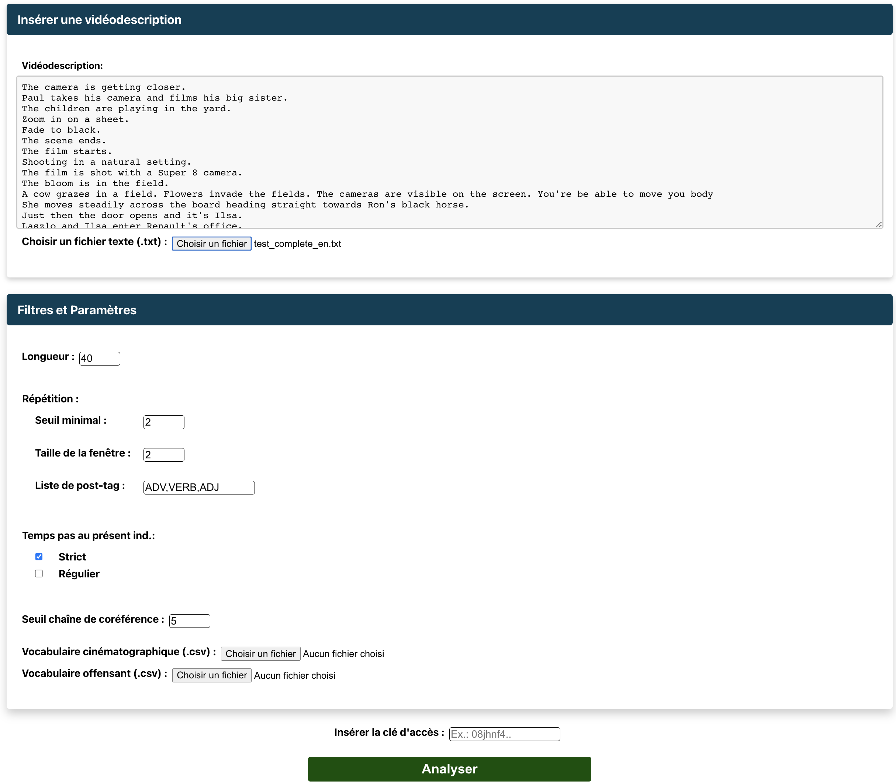

# VDQUAL-outil <!-- omit in toc -->

> Le contenu suivant est également disponible en français [ici](./README.md).
## Table of Contents <!-- omit in toc -->
- [License](#license)
- [Introduction](#introduction)
- [Detections](#detections)
- [VD-QUAL-Emotions](#vd-qual-emotions)
- [Web Application and API](#web-application-and-api)
  - [Web Application](#web-application)
    - [Usage Conditions](#usage-conditions)
    - [Insert and Analyze](#insert-and-analyze)
    - [Result](#result)
  - [API](#api)
- [Local installation, startup and usage with custom model](#local-installation-startup-and-usage-with-custom-model)
  - [Requirements](#requirements)
  - [Docker Compose](#docker-compose)
  - [Makefile](#makefile)
- [Operation](#operation)
- [Contributors and Acknowledgments](#contributors-and-acknowledgments)
- [References](#references)
  - [Citation](#citation)

## License

[license-file]: ./LICENSE
This work is licensed under the [MIT License][license-file].<br>

See the [LICENSE](LICENSE) file for more details.

See also the [Citation](#Citation) requirements.

## Introduction

**VDQUAL-tool: Tool for verifying the quality of video descriptions in French and English.**

The tool is available online at the following address: https://vdqual.crim.ca .

This code was used as part of a project with
the _Broadcasting Accessibility Fund_ ([BAF]((https://www.baf-far.ca/en))).

This project aims to develop a VDQUAL tool for verifying the quality of video descriptions (VD)
films and television series in English or French to support stakeholders involved in
the production of VD and thus improve the accessibility of broadcast content.

We rely on VD's writing guides which emphasize the need for well-written texts to
allow visually impaired people to fully enjoy their experience.
From a textual point of view, the recommendations aim to ensure:

- Good language accessibility (at the lexical level: language register, polysemy to be avoided,
  variety of verbs, etc.).
- The consistency of the text (at the syntactic level: avoiding confusion brought about by the use of coreference,
  or inadequate verb tenses).
- The lack of interpretation of the video-descriptor (at the semantic level: avoiding marks of subjectivity and
  describing only what is seen on the screen).

The tool we have designed therefore aims to integrate detection rules for some of these recommendations.
It is a research and exploration tool, offered to the community. Some detections are exploratory.

We have implemented 8 detection rules based on three axes:

- **Clear and obvious text**:
    - **Detection of sentences that are too long** which could overload the listener cognitively
    - **Detection of repetitions of lemmas** in a sliding window which can make the text daunting
    - **Detection of coreference chains** that are too long which can confuse the text. The objective is to guarantee
      the absence of referential ambiguity in the described video analyzed. Indeed, throughout the video description of
      a
      work, the listener must know who is being referred to in the visual work. At the time of
      writing a VD, the video-descriptor must therefore juggle between explicit mentions of the name of the character
      or of an object, but it
      must also keep a certain fluidity so as not to make the text unnecessarily heavy. We therefore tolerate doing
      covers
      anaphoric if there is no ambiguity about the referent and if the mention of the referent is not too far away.
      This
      detection is exploratory and uses [Coreferee](https://pypi.org/project/coreferee/), a coreference detection tool.


- **Respect for the fictional universe**:
    - **Detection of cinematographic vocabulary** so as not to take the listener out of fictional reality. He is
      possible to import your own dictionary.
    - **Detection of verbs that are not in the present indicative** to prevent a VD from following the
      progress
      actions proposed by the film, the biggest pitfall being for example to describe an action in advance and
      spoil
      the surprise effect.
    - **Detection of first or second person marks**. At no time should the video descriptor mark his
      presence (with an “I”) or address the listener (second-person singular or plural or
      first-person plural). To ensure that it remains factual, the narrative must be in the third person
      uniquely.

- **Absence of extrapolation, over-interpretation or bias**:
    - **Detection of offensive vocabulary**: the video descriptor must not use offensive vocabulary
      (explicit bias). The dictionary is not exhaustive, it is possible to import your own dictionary.
    - **Detection of emotional states** (_being sad_) to distinguish emotional actions (actions induced by a
      emotion)
      (ex: _crying_). In the standards of VD, it is indicated that the description of emotional state is to be avoided,
      because
      it is of the order of an interpretation of the video-descriptor. Instead, give preference to a description
      facts of the character's actions. This detection is exploratory. We refer you to the
      [README](./VD-QUAL-Emotions/README_EN.md) of the
      [`VD-QUAL-Emotions`](./VD-QUAL-Emotions) directory for more information.
<br><br>

## Detections

1. **Length**

   The tool detects sentences that are too long.
    - Definition of the parameter: `maximum threshold of words in a sentence`. Beyond this threshold, there is an alert.

2. **Repetition**

   The tool detects repetitions of identical lemmas in a sliding window throughout the
   described video. Thus, for a given line, if the window is 5, the tool detects the repetitions which occurred
   on the 5 lines above and the 5 lines below. The repetitions are counted based on the lemmas of the words and
   not the surface forms (ex: the three surface forms walk, will walk, walk have the same lemma "walk").

    - Three parameters for this alert:
        - `Minimum threshold`: minimum repetition threshold detected (from this threshold, there is an alert);
        - `Window size`: number of lines looked at before and after (e.g.: if it is 2, we look at the 2 lines before
          and the
          2 lines later);
        - `List of post-tag`: list of grammatical categories of the lemmas that we want to detect
          (e.g.: `ADV`, `V`, `ADJ`, see list of [Universal Dependencies](https://universaldependencies.org/u/pos/)).

3. **Verbs that are not present indicative.**

    - A parameter: choice of `strict` or `regular` mode.
        - The **regular mode** detects verbs used in any tense or mode other than the present indicative. It takes into
          account of course some subtleties. For example, in French, a past participle can be used in the present tense
          when it is used as an adjective (e.g.: _Vue sur le paysage
          enchanté_) or in the passive form with the auxiliary
          be (e.g.: _Asterix and Obélix are hypnotized._), whereas if it is used with the auxiliary avoir it is a past
          tense and in this case there is has an alert (e.g.: _They have crossed the sea_).
        - The **strict mode** also detects certain periphrastic turns such as \[_come from_ + infinitive verb] which
          describes a past action (e.g.: He just crossed) and \[_go_ + infinitive verb]
          and \[_is going to_ + infinitive verb] which describe future actions (e.g. _He is going to dial a number_).

4. **Person**

   Detection of all pronouns that are not in the third person. These can be personal pronouns
   (_I, we, you, we,_ etc. ), possessive (_my, yours, my,_ etc.) or demonstrative (_tes, ma, your,_ etc.) pronouns.
    - No parameter for this detection.

5. **Film Vocabulary**

   Detection of all words belonging to a dictionary of cinematographic words.
    - It is possible to load a personal dictionary instead in `.csv` format. This dictionary must be composed
      at least one column with the words to locate. The column must have the title `EN` and `FR` as appropriate.
      Two `EN` and `FR` columns are also possible separated by tabs.

6. **Offensive vocabulary**

   Detection of all words belonging to a dictionary of offensive words (racist, homophobic, sexist
   and validist are included). We cannot guarantee any completeness.
    - It is possible to load a personal dictionary instead in .`csv format.` This dictionary must be composed
      at least one column with the words to locate. The column must have the title `EN` and `FR` as appropriate.
      Two `EN` and `FR` columns are also possible separated by tabs.

7. **Emotions**

   Detection of words or sequences of words expressing an emotion. The tool tries to differentiate between states
   emotional (e.g. _He is sad_) and emotional actions (e.g. _He is crying_).
    - In case of `emotional action`, there is no alert, but the words expressing the emotion are displayed.
    - In case of `emotional state`, there is an alert visible thanks to the symbol `(e)` in red.

   This detection is exploratory and uses an artificial intelligence model. See section below.

8. **Co-reference chains**

   Detection of coreference chains that are too long. As soon as there is an explicit mention (a first name rather
   than a coreference like a pronoun), the chain is reset. Coreference chains ideally concern only one mention (ex:
   _Pierre_) and its anaphoric pronouns (e.g.: _Il, son,_ etc.). If these are too numerous before a new
   explicit mention, the chain is considered too long.

    - Parameter: `maximum size of coreference strings`.
      The tool displays all coreference chains.
      Members of the same coreference chain have the same identifier (number in square brackets).
      Members of chains that exceed the maximum coreference size are shown in red.

   This detection is exploratory and uses an artificial intelligence model.
<br><br>

## VD-QUAL-Emotions

To detect emotions and distinguish emotional actions from emotional states, we adapted the code from
the article
[Learning Span-Level Interactions for Aspect Sentiment Triplet Extraction](https://aclanthology.org/2021.acl-long.367)
from Xu et al., ACL-IJCNLP 2021. The code is available here: https://github.com/chiayewken/Span-ASTE.

Annotated data and trained model are available
[here](https://drive.google.com/drive/folders/1sLiYm2nzTi7_9cls_-Mn_CCwItdYTs3C). 
For more details, please consult the github directory [vdqual-emotions](https://github.com/crim-ca/vdqual-emotions) dedicated to this project.

The data and the model for the French emotions detection is protected by the [Creative Commons Attribution-NonCommercial-ShareAlike 4.0 International License][cc-by-nc-sa].

[![CC BY-NC-SA 4.0][cc-by-nc-sa-image]][cc-by-nc-sa]

[cc-by-nc-sa]: http://creativecommons.org/licenses/by-nc-sa/4.0/
[cc-by-nc-sa-image]: https://licensebuttons.net/l/by-nc-sa/4.0/88x31.png
[cc-by-nc-sa-shield]: https://img.shields.io/badge/License-CC%20BY--NC--SA%204.0-lightgrey.svg

<br><br>

## Web Application and API

A web application and an API have been deployed on servers of CRIM. <br>
The web application can be found at: https://vdqual.crim.ca

To have access to the analysis offered by this service, it is mandatory to have the access key to launch an analysis.
To get this key, just go to the section [Usage Conditions](#usage-conditions).

### Web Application

#### Usage Conditions


#### Insert and Analyze


#### Result


### API

It is possible to launch analysis requests with the API hosted at CRIM at the following link:
https://vdqual.crim.ca/vdqual/predict.

However, these requests require having the previously mentioned access key.

Here is an example query with Python:

```python
import requests

ACCESS_TOKEN = "..."  # FIXME: set your token here
HEADERS = {'Authorization': f'Bearer {ACCESS_TOKEN}'}

json_input = {
    "text": "Zoom sur une feuille.\nUne actrice joue une scène. Des actrices se saluent.\n",
    "maxCorefLength": 5,
    "maxLength": 40,
    "seuilDuplication": 2,
    "windowDuplication": 2,
    "temps": "strict",
    "postTagRepetition": [
        "ADV",
        "VERB",
        "ADJ"
    ],
    "vocCinema": "SOURCE\tTERM_EN\tTERM_FR\nVoc_cinema\tactor\tacteur\nVoc_cinema\tactress\tactrice\n",
    "vocOffensant": "SOURCE\tTERM_EN\tTERM_FR\r\nvoc_offensant\tAble-bodied amerloque\r\nvoc_offensant\tauntie\tAnnamite",
}

response = requests.post(url="https://vdqual.crim.ca/vdqual/predict", json=input, headers=HEADERS)
output = response.json()
```
<br><br>

## Local installation, startup and usage with custom model

### Requirements

To use this tool, it will be necessary to have installed the Docker tool. To do this, follow the instructions on the
installation page: [Docker Engine](https://docs.docker.com/engine/install/).

### Docker Compose
To install and start the tool with Docker, just run the following commands at the root of the project
[`vdqual-outil`](.):

1. Run the build command
   ```shell
   docker compose -f docker/docker-compose.yml build
   ```

2. Launch the tool trough docker compose:
   ```shell
   docker compose -f docker/docker-compose.yml up
   ```

### Makefile

This tool can also be run by using the Makefile.
For this to work, GNU Make has to be installed: [GNU Make](https://www.gnu.org/software/make/)

- Build images
  ```shell
  make build
  ```
- Start the tool
  ```shell
  make start 
  ```
- Stop the tool
  ```shell
  make stop
  ```
- Follow the tool logs
  ```shell
  make stop
  ```

## Operation

Here is an example with Python.

```python
import requests

json_input = {
    "text": "The camera is getting closer.\nPaul takes his camera and films his big sister.\n",
    "maxCorefLength": 5,
    "maxLength": 40,
    "seuilDuplication": 2,
    "windowDuplication": 2,
    "temps": "strict",
    "postTagRepetition": [
        "ADV",
        "VERB",
        "ADJ"
    ],
    "vocCinema": "",
    "vocOffensant": "",
    "lexiquePerso": ""
}

response = requests.post(url="127.0.0.1:5008/predict", json=json_input)
output = response.json()
```
<br><br>

**Result** : An example of a complete output is in the file [output.example.json](./output.example.json)
at the root of the project.
<br><br>

## Contributors and Acknowledgments

The project received funding from the _Broadcasting Accessibility Fund_ ([BAF]((https://www.baf-far.ca/en))).

The raw data we annotated for emotion detection comes from part of the
corpus [Fr-VD](https://github.com/crim-ca/FrVD).

The training of the emotion detection model is done thanks to the article
[Learning Span-Level Interactions for Aspect Sentiment Triplet Extraction](https://aclanthology.org/2021.acl-long.367)
from Xu et al., ACL-IJCNLP 2021. The code is available here: https://github.com/chiayewken/Span-ASTE.

Coreference detection is done using the [Coreferee](https://pypi.org/project/coreferee/) tool.

The guides we consulted to define the detections are as follows:

- “_ITC Guidance On Standards for
  Audio Description May 2000_”,
- “_Canadian Network for Inclusive Cultural Exchange (CNICE). General guidelines for
  inclusive online cultural content_”,
- “_Snyder, J. (2010). Audio Description Guidelines and Best Practices.
  A Work In Progress._”,
- “_Netflix Audio Description Style Guide V2.3_”,
- “_Conseil supérieur de l’audiovisuel, 2020:
  Guide to audio description,
  Essential principles, assessment tool and good professional practices_”.
<br><br>

## References

**VDQUAL-tool: Tool for verifying the quality of video descriptions in French and English.**

Please reference these works using the following citation.

### Citation

```bibtex
@techreport{VDQUAL_tool,
    title = "Tool for verifying the quality of video descriptions in French and English.",
    author = "Edith Galy, Azur Handan",
    institution = "Computer Research Center of Montreal (CRIM)",
    address = "405 Ogilvy Avenue #101, Montreal, QC H3N 1M3",
    year = 2023,
    month = june
}
```
